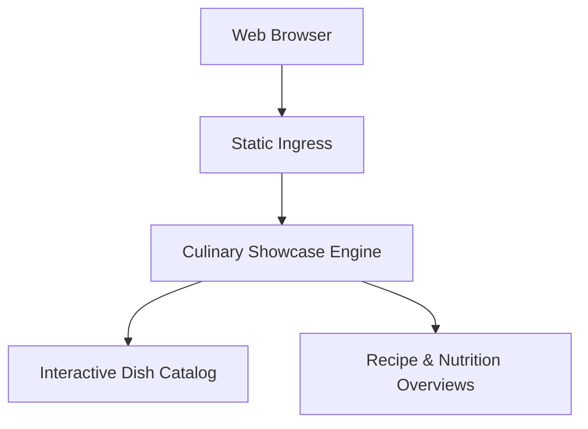

# Food Showcase Portal: Interactive Culinary Catalog

Interactive culinary showcase web application highlighting seasonal menus, signature preparations, and dining booking experiences.

## Features

- **Interactive Showcase**: Visual gallery of culinary offerings and daily dining specials.
- **Responsive Layout**: Designed for seamless browsing across mobile and desktop devices.
- **Lightweight Zero-Dependency Execution**: Fast client rendering using standards-compliant HTML5 and CSS3.

## Running Locally

Open `index.html` or `showcase.html` in your browser.
